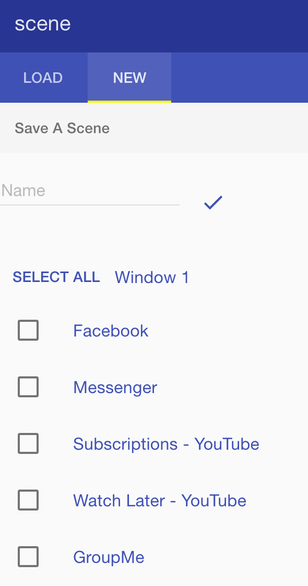
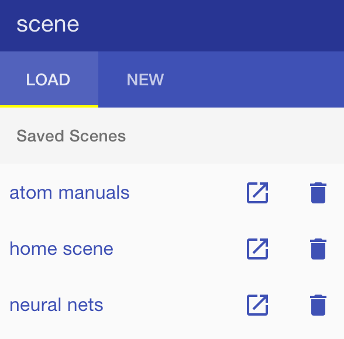

# scene
chrome extension in AngularJS and Angular Material to manage collections of tabs

### Load scene

This is the default screen of the extension.  It shows previously saved scenes (groups of tabs).
The icon buttons on the right allow you to open or delete a scene.

### Save scene

You can select any combination of tabs from windows you currently have open and save them as a scene.
You can save a whole window, just one tab, or just a handful of tabs scattered across your windows.

### Using this extension

If you just want this extension for use, you can use the scene.crx file included in the repo.  

If you want to play with the code, you can add it as an unpacked extension.

Instructions for both methods are [here](http://superuser.com/questions/247651/how-does-one-install-an-extension-for-chrome-browser-from-the-local-file-system).
